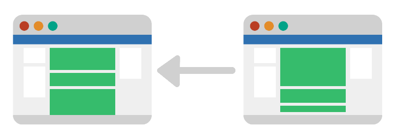

# Jaz.js

[Visit the live demo site](https://github.com/nickzuber)

Jaz provides websites with the power and behavoir of a [SPA](https://msdn.microsoft.com/en-us/magazine/dn463786.aspx) but with the traditional structure of an average website. While Jaz works optimally with a homogeneous web structure, it can be applied in any situation. 

---

*Important to note that Jaz.js is still in Alpha and is not intended for production yet.*

---

## Description
Load and render web pages through the use of history API and AJAX to
provide a seamless and smooth transition. Jaz takes predetermined
contents of web pages and dynamically renders them onto the current
page, while asynchronously utilizing history API to navigate the user to
that web page, ultimately providing a smooth page transition.

## Explanation
Traditonal links simply redirect the user to an entirely new page, consequently removing the user, for at least a few moments, from the website's native experience. With Jaz, the user doesn't have to go to the new page, rather the new page comes to the user! This provides a seamless and smooth experience while traversing a website.



## Installation
Simply include the jaz production file on your webpage (preferably all webpages).
```html
<script type="text/javascript" src="scripts/jaz.min.js"></script>
```
*Jaz is currently not available as an npm package until an official release is made.*

## Configuration
Next, you need to instantiate a Jaz object
```javascript
var J = new Jaz();
```
Then, simply configure the Jaz object with settings:
 - `scope`: *string*, specifies what links are to be affected by Jaz (`*` flag is all links)
 - `intermission`: *object*, holds two functions that are to execute when a link within the scope is clicked and when new content has rendered respectively
   - `loading`: *function*, fires when a link is clicked
   - `callback`: *function*, fires when new content has rendered
 - `delay`: *number*, adds a delay in milliseconds from when the `loading` function fires and the routing process begins (defaults to 0)
 - `targetArea`, *string*, specifies where the newly rendered content will be loaded into

A basic configuration can look something like this
```javascript
 J.config({
    scope: "*", // Wildcard flags all links on the page
    intermission: {
      loading: loadingFunction,
      callback: loadedFunction
    },
    delay: 1000, // 1 second delay
    targetArea: "body" // Denotes the <body> tag
  });
```
Once Jaz is configured and ready to go, simply tell it to start listening and you're good to go
```javascript
J.listen();
```

## Testing
While Jaz by itself is a standalone software, some tools and utilities are used for building and testing purposes. All of the required files are located in the `/test` directory for testing. Any dependencies will already be integrated into the test code, but for reference and documentation they will be listed below:
##### Dependencies
 - RequireJS - http://requirejs.org/

## License
[MIT](https://opensource.org/licenses/MIT)

Copyright (c) 2015 Nick Zuber
